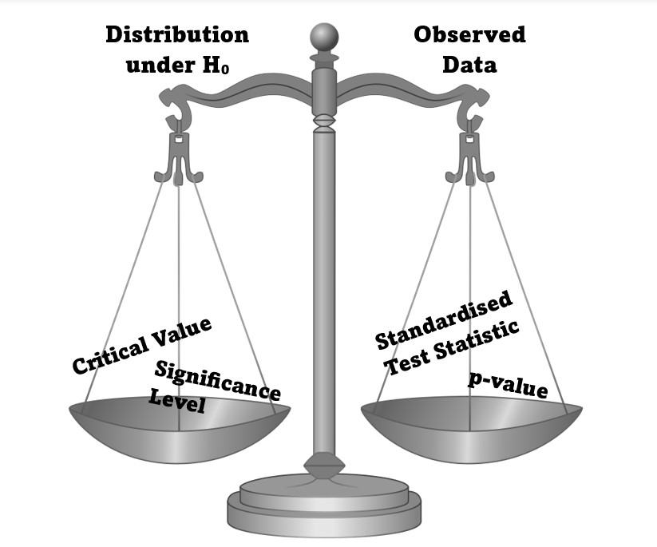

# The Basic Premise of Hypothsis Testing




**All hypothesis tests that we will look at in these labs will fit the same pattern:**

We want to decide if the observed data from our study provides evidence to reject a baseline assumption (a null hypothesis).

For all tests, we will compare our observed data to an expected distribution from the null hypothesis.

*The values used in this comparison:*
The test will have a significance level and we find the critical value that corresponds to this to decide on a Rejection Region (shown in red on the graph below). This is the part of our distribution that we decide is unusual and could disprove our null hypothesis.

We calculate a Standardised Test Statistic from our data and find its corresponding area on the distribution, the $p$-value, to be able to compare what we saw to the distribution (illustrated in blue on the graph below).

How the Standardised Test Statistic compares to the rejection region, and hence how our $p$-value compares to the significance level, is what changes the conclusion of our hypothesis test.

```{r, echo=FALSE, eval=TRUE}
library(latex2exp); library(ggplot2)
alpha <- 0.025
critical_value <- qnorm(alpha)
x <- seq(-3, 3, length.out = 1000)
z_dist <- data.frame(x = x, y = dnorm(x))


# Create t distribution plot and alpha below in the function is transparency of the region
ggplot(z_dist, aes(x)) +
  geom_line(aes(y = y), size = 1) +
  geom_area(data = subset(z_dist, x < critical_value), aes(y = y), fill = "red", alpha=0.1) +
  geom_area(data = subset(z_dist, x < -1.2), aes(y = y), fill = "blue", alpha=0.1) +
  geom_area(data = subset(z_dist, x > -critical_value), aes(y = y), fill = "red", alpha=0.1) +
  geom_area(data = subset(z_dist, x > 1.2), aes(y = y), fill = "blue", alpha=0.1) +
  geom_segment(aes(x = critical_value, y = -0.025, xend = critical_value, yend = dnorm(critical_value)), colour="red")+
  geom_segment(aes(x = -1.2, y = -0.04 , xend = -1.2, yend = dnorm(-1.2)), colour="blue")+
  geom_segment(aes(x = -critical_value, y = -0.025, xend = -critical_value, yend = dnorm(critical_value)), colour="red")+
  geom_segment(aes(x = 1.2, y = -0.04 , xend = 1.2, yend = dnorm(1.2)), colour="blue")+
  labs(title = TeX("Example of two-tail hypothesis test with $\\alpha = 0.05$ using a normal distibution"),
       x = "Z-Score",
       y = "Probability Density") +
  annotate("text", x = -2.3, y = 0.01, label = TeX("$\\alpha/2 = 0.025$"), size = 2.5, colour="red") +
  annotate("text", x = -2, y = -0.03, label = TeX("-Critical Value"), vjust = 0.4, size=2.5, colour="red") +
  annotate("text", x = -1.55, y = 0.05, label = TeX("p-value$/2$"), size = 2.5, colour="blue") +
  annotate("text", x = -1.4, y = -0.04, label = "-the value of the observed Standardised Test Statistic", vjust = 0.4, size=2.5, colour="blue") +
  annotate("text", x = 2.3, y = 0.01, label = TeX("$\\alpha/2 = 0.025$"), size = 2.5, colour="red") +
  annotate("text", x = 2, y = -0.03, label = TeX("Critical Value"), vjust = 0.4, size=2.5, colour="red") +
  annotate("text", x = 1.55, y = 0.05, label = TeX("\\p-value$/2$"), size = 2.5, colour="blue") +
  annotate("text", x = 1.4, y = -0.04, label = "the value of the observed Standardised Test Statistic", vjust = 0.4, size=2.5, colour="blue") +
  coord_cartesian(ylim=c(0,NA),expand = FALSE, clip="off")+
  theme_minimal()
```

*The graphical example above is a test that would assume normally distributed data and would result in failing to reject the null hypothesis.*
*The red area is our rejection region.*
*The blue area represents the probability of seeing our observed data assuming the null hypothesis is true (this probability is known as the $p$-value).*
*The Standardised Test Statistic does not sit in the rejection region. As a result the blue area is greater than the red area meaning our data was not unusual compared to the distribution where the null hypothesis is true.*


## The 5 steps of Hypothesis Testing 

In the next few labs we will look through different scenarios where we might conduct a hypothesis test.

In your textbook and lectures you have seen these tests broken into 5 steps. 

Often when undertaking hypothesis tests in R, we find the Standardised Test Statistic and $p$-value in one action such as when using `t.test()`. In the labs the 5 steps will therefore be arranged as follows:

1. **Hypotheses**
    - Set up the null and alternative hypotheses to answer your question
2. **Test Statistic Selection** 
    - Choose your Test Statistic
3. **Hypothesis Test Calculations**
    - Find the Critical Value and Rejection Region from the distribution
    - Calculate the Standardised Test Statistic from the observed data
    - Find the $p$-value that corresponds to the Standardised Test Statistic
4. **Statistical Conclusion**
    - Comparing the observed value of the Standardised Test Statistic to the Rejection Region or Critical value
    - Comparing the $p$-value to the significance level
5. **English Conclusion**
    - Giving the meaning of statistical conclusion in context of the question.
  
(Note this is slightly different to the the wording in the textbook just for simplicity of grouping together all calculations in R within Step 3.)

We shall consistently find the Rejection Region and then analyse our observed data to compare it to that region.