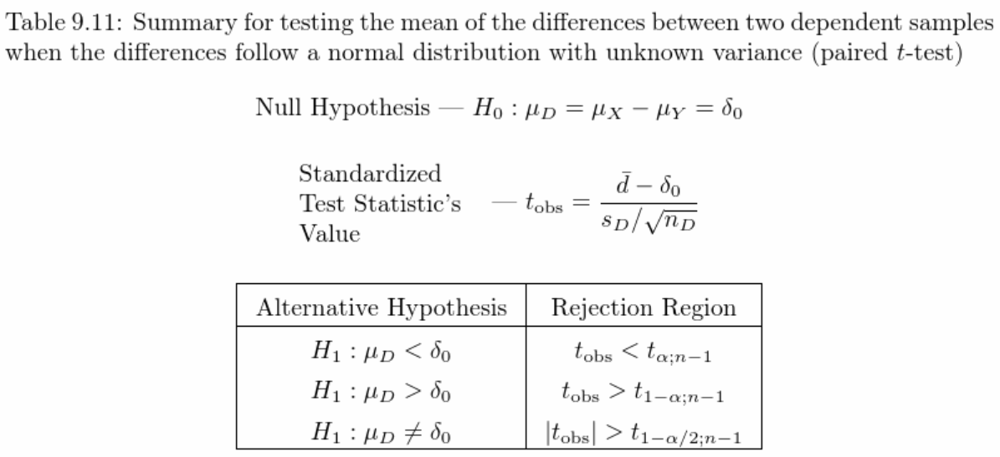

```{r, include = FALSE}
knitr::opts_chunk$set(echo = TRUE, warning = FALSE, message = FALSE)
library(webexercises)
library(tinytex)
library(dplyr)
library(knitr)
library(ggplot2)
library(tidyverse)
library(PASWR2)
library(MASS)
REFRIGERATOR <- REFRIGERATOR
TENNIS <- TENNIS
HUBBLE <- HUBBLE

```


```{r include=FALSE, echo=FALSE}
knitr::write_bib(c(
  .packages(), 'bookdown', 'knitr', 'rmarkdown'
), 'packages.bib')
```

# Welcome to Lab 2

Intended Learning Outcomes:

1. Complete a two-sample t-test for the difference in the means assuming unequal variances in R with a step-by-step guide.
2. Complete a paired t-test for the difference in the means in R with a step-by-step guide.
3. Complete a paired hypothesis test for the difference in the means in R by yourself.

## A Summary of the Type of the Hypothesis Test Used Today 




## Credit where credit is due

The labs in S2 incorporate and adapt materials from:

Ugarte, M. D., Militino, A. F., & Arnholt, A. T. (2008). [Probability and Statistics with R](https://ebookcentral.proquest.com/lib/gla/detail.action?docID=5338596). CRC press.

The materials were converted into interactive labs on Hypothesis Testing using `Bookdown` and `webexercises` in Summer 2023 by summer project student, Megan Ruffle.
