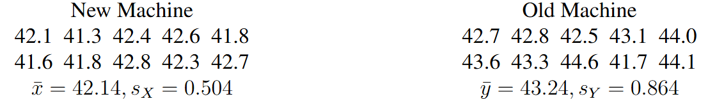
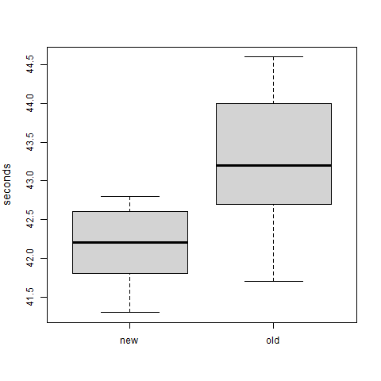
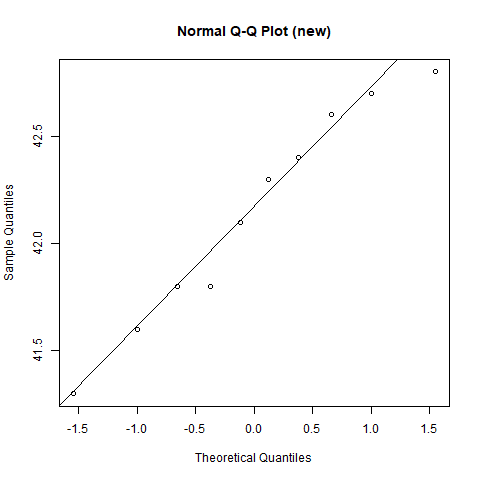
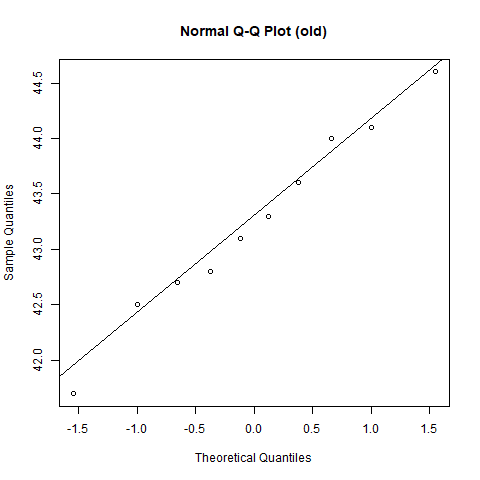

# Written Tasks

## Question 1
A pasta company wants to determine whether the average weight of macaroni in their one-pound boxes is equal to 454 grams (1 pound $\approx$ 454 grams). A sample of 14 boxes is selected, and their weights (in grams) are recorded as follows:

(a) State the assumptions that need to be verified before conducting a hypothesis test to answer the company's question.

(b) Assuming the necessary assumptions are met, perform the appropriate hypothesis test at a significance level of 10%. Some summary statistics are provided below:
\[\text{sample mean: } 459.21, \quad \text{sample variance: } 11.57\]

(c) Describe the steps to compute the power of the hypothesis test when the true mean weight is 453.592 grams, assuming the true variance of the box weights is 12. Your description should clearly state the test statistic, its associated parameters (e.g. degrees of freedom for a $t$-distributed random variable), and the critical values. The exact numerical value of the power is not required.

## Question 2

In a packing plant, a machine packs cartons with jars. It is supposed that a new machine will pack faster on the average than the machine currently used. To test that hypothesis, the times it takes each machine to pack ten cartons are recorded (in seconds). The results, as well as the sample mean ($\bar{\cdot}$) and sample standard deviation ($s_\cdot$), are shown in the tables below.



The figures below show the boxplots and normal quantile-quantile (Q-Q plot) for the new and old machines. 

```{r out.width="25%", echo=FALSE}



```


(a) Comment on the suitability of a normal model for data on the new machine and old machine.  

(b) Perform a hypothesis test to determine whether the new machine will pack faster on the average than the machine currently used using a significance level of 5%. 

*Solution will be available on Moodle after Wednesday 4pm.*
