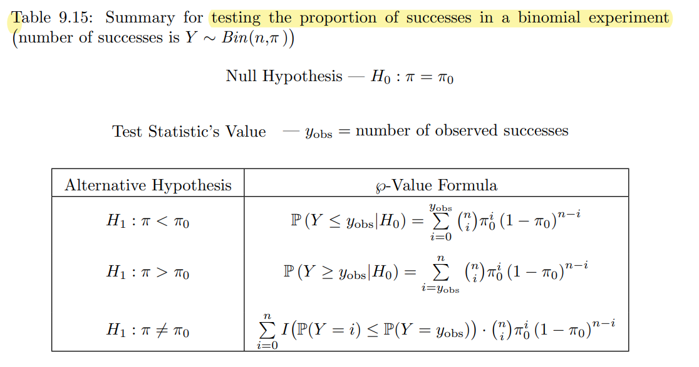
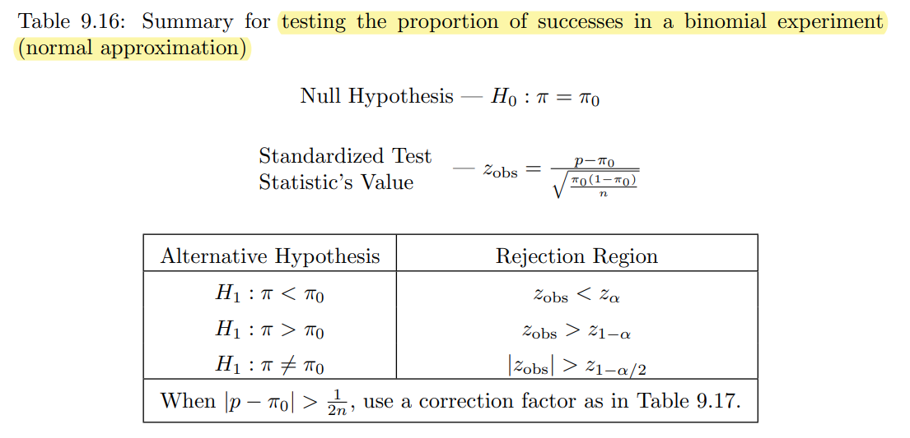

```{r, include = FALSE}
knitr::opts_chunk$set(echo = TRUE, warning = FALSE, message = FALSE)
library(webexercises)
library(tinytex)
library(dplyr)
library(knitr)
library(ggplot2)
library(tidyverse)
library(PASWR2)
library(PASWR)

```


```{r include=FALSE, echo=FALSE}
knitr::write_bib(c(
  .packages(), 'bookdown', 'knitr', 'rmarkdown'
), 'packages.bib')
```
# Welcome to Lab 4

Intended Learning Outcomes:

1. Conduct a hypothesis test for the population proportion in `R` with a step-by-step guide.
2. Conduct a goodness-of-fit test in `R` with a step-by-step guide.
3. Conduct hypothesis test of independence or homogeneity in `R` with a step-by-step guide. 

## A summary of the type of the hypothesis test and R commands used today

**Test for population proportions**


The exact Binomial test can be implemented in R by using `binom.test`:
```{r eval=FALSE}
binom.test(x, n, p = 0.5,
           alternative = c("two.sided", "less", "greater"),
           conf.level = 0.95)
```

* `x`: number of successes
* `n`: number of trials
* `p`: hypothesized probability of success, i.e. $\pi$ under $H_0$
* `alternative` and `conf.level`: same as explained in the `var.test` function. 

<br>



Testing the proportion of successes in a Binomial experiment with normal approximation can be performed by using `prop.test`:
```{r eval=FALSE}
prop.test(x, n, p = NULL,
          alternative = c("two.sided", "less", "greater"),
          conf.level = 0.95, correct = TRUE)
```

All arguments are the same as in the `binom.test()` function. 

<br>

**Goodness-of-fit test**

The test criterion for testing $H_0: F_X(x) = F_0(x)$ for all $x$ against the alternative $H_1: F_X(x) \neq F_0(x)$ for some $x$ when the null hypothesis is completely specified is
\[\chi^2_\text{obs} = \sum_{k=1}^K \frac{(O_k-E_k)^2}{E_k},\]
where $K$ is the total number of categories.

For large $n$, provided all expected categories are at least 5, $\chi^2_\text{obs}$ is distributed approximately $\chi^2_{K-1}$.

The test can be performed by using `chisq.test`:
```{r eval=FALSE}
chisq.test(x, p)
```

* `x`: a vector of observed counts in each category
* `p`: a vector of probabilities for the observations falling into each category

<br>

**Test of independence and test of homogeneity**

The test criterion for test of independence, i.e. 
$$H_0: \pi_{ij} = \pi_{i\bullet} \pi_{\bullet j} \text{ vs } H_1: \pi_{ij} \neq \pi_{i\bullet} \pi_{\bullet j} \text{ for at least one } i,j,$$
and the test criterion for test of homogeneity, i.e. 
$$H_0: \pi_{1j} = \pi_{2j} = \cdots = \pi_{Ij} \text{ for all $j$ vs } H_1: \pi_{ij} \neq \pi_{i',j} \text{ for some } (i,i',j),$$
is
\[\chi^2_\text{obs} = \sum_{i=1}^I\sum_{j=1}^J \frac{(O_{ij}-E_{ij})^2}{E_{ij}},\]
where $I$ is the total number of rows and $J$ is the total number of columns. As the test criterion has the same form as the goodness-of-fit test, the same R command can be used to perform the test: `chisq.test(data)`, where `data` is the $I \times J$ contingency table collected from the experiment.
