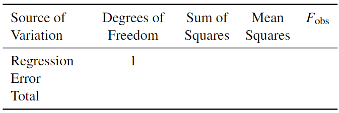
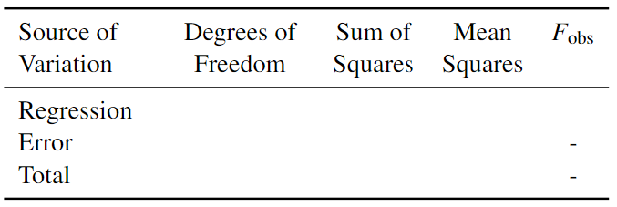

```{r setup, include = FALSE}
library(webexercises)
library(tinytex)
library(dplyr)
library(knitr)
library(PASWR)
library(PASWR2)
knitr::opts_chunk$set(echo=TRUE, eval=TRUE)

```


```{r include=FALSE, echo=FALSE}
knitr::write_bib(c(
  .packages(), 'bookdown', 'knitr', 'rmarkdown'
), 'packages.bib')
```


# Welcome to S2Y Lab 7

Intended Learning Outcomes:

- obtain the elements of an analysis of variance (ANOVA) table;
- use the ANOVA table to compute and interpret the $F$-statistic and its hypothesis test;
- assess the goodness of fit of linear models based on $R^2$ and $R^2_a$.

## Introduction

### The ANOVA table
In the lectures we studied analysis of variance (ANOVA) table which can be used to investigate the variability explained by the model. It is based on partitioning the sums of squares ($SS$) and the degrees of freedom (df) associated with the response variable $Y$. The total deviation, $Y_i - \overline{Y}$, can be decomposed as 

1. The deviation from the fitted value $\hat{Y}_i$ to the mean $\overline{Y}$ and

2. The deviation fo the observation $Y_i$ to the regression line $\hat{Y}_i$. 

$$\underbrace{Y_i - \bar{Y}}_{\text{Total Deviation}} = \underbrace{\hat{Y_i} - \bar{Y}}_{\substack{\text{Deviation of Fitted}\\ \text{Regression Value}\\ \text{around the Mean}}} + \underbrace{Y_i - \hat{Y_i}}_{\substack{\text{Deviation around}\\ \text{the Fitted Regression Line}}}$$

When we take the sum over all observations and square it, we obtain the following equation, which decomposes the total variability in the response into two parts::

$$\underbrace{\sum_{i=1}^n(Y_i - \bar{Y})^2}_{SST} = \underbrace{\sum_{i=1}^n(\hat{Y_i} - \bar{Y})^2}_{SSR} + \underbrace{\sum_{i=1}^n(Y_i - \hat{Y_i})^2}_{SSE}$$

We have 

* $SST$: Total sum of squares

* $SSR$: Regression sum of squares

* $SSE$: Error (residual) sum of squares.

In a simple linear regression (only one predictor), degrees of freedom can be partitioned as: $SST$ has $n-1$ degrees of freedom, $SSE$ has $n-2$, and $SSR$ has $1$. If we divide the $SS$ by its degrees of freedom, we obtain the mean square as 

$$\frac{SSR}{1} = MSR \text{ and } \frac{SSE}{n-2} = MSE$$


When $\beta_1 = 0$, meaning the predictor does not have an effect in our regression, the $MSR$ and $MSE$ will be similar in magnitude. If $\beta_1\neq0$, the center of the $MSR$ will be larger than that of $MSE$. 

<center>
{width=500px}
</center>

We can use this understanding to test the effect of the predictor in the model using a hypothesis test. In particular, we could test $H_0: \beta_1 = 0$ versus $H_1: \beta_1 \neq 0$ using the test statistic

$$F_\text{obs} = \frac{MSR}{MSE}$$

When the null hypothesis is true, i.e. $H_0: \beta_1 = 0$, then
$$F_\text{obs} = \frac{MSR}{MSE} \sim F_{1,n-2}.$$

As a wide rule of thumb, you can say that values of $F_{obs}$ close to $1$ generally support the null hypothesis while larger values will support the alternative. However, you will always need to compare it with a critical value found using a statistical table or look at the $p$-value produced in `R`. To generate an ANOVA table on linear objects, use `anova(lm.object)`. 

The full ANOVA table for a single predictor looks like this:
<center>
{width=600px}
</center>

More generally, for a multiple linear regression with $p-1$ predictors, the ANOVA table looks like this:

<center>
{width=600px}
</center>

We can perform $F$-test to test whether all parameters in the model of interest (i.e. all parameters excluding the intercept) are zero:

$$H_0: \beta_1 = \beta_2 = \cdots = \beta_{p-1} = 0 \quad \text{versus} \quad H_1: \text{at least one } \beta_i \neq 0 \text{ for } i =1, 2, \ldots, p-1.$$
The test statistic is again $F_\text{obs} = \frac{MSR}{MSE}$ and under the assumption that $H_0$ is true,

$$F_\text{obs} = \frac{MSR}{MSE} \sim F_{p-1;n-p}.$$


### $R^2$

ANOVA table also allows us to easily calculate the **coefficient of determination**, $R^2$. $R^2$ is a useful tool to assess the goodness-of-fit of our linear regression models. It provides a measure for the proportion of variability in the $Y_i$s that can be explained by our model. The formula of $R^2$ is given by:

$$R^2 = 1-\frac{SSE}{SST} = \frac{SSR}{SST}. $$


Think about it this way: if $SSE$ is the sum of squares of the error, it can be interpreted as the amount of variability in $Y$ that is not explained by the model. $SST$ represents all the variability in the data. If our model did not explain any variation, it would be equivalent to a horizontal line and $SSE=SST$. Therefore, the ratio of $\frac{SSE}{SST}$ represents the proportion of variability not explained by the model and $1-\frac{SSE}{SST}$ is the variability explained. 

<center>

{width=250px}
{width=250px}
{width=250px}
</center>

In today’s lab we will first revisit ordinary least squares estimates (OLS) and then delve into the coefficient of determination ($R^2$) and the analysis of variance (ANOVA) table to deepen our understanding of the `R` output. 


## Exam-style questions
This section is designed to help you make connections between the lab content and the exam questions. In the exam, since you will not have access to R and the data, the questions will be phrased as the example questions below. Try to think about them as you work through the examples and exercises in this lab. 


 **Question 1:** Given the following summary statistics

$$\sum_{i=1}^{20} \left(Y_i - \hat{Y}_i\right)^2 = 6.94983 \quad\quad \sum_{i=1}^{20} \left(Y_i - \bar{Y}\right)^2 = 13.09869,$$

complete the analysis of variance table below.

<center>

{width=450px}

</center>


**Question 2:** The following linear model was fitted to some data:

\[\mathbb{E}(Y_i) = \beta_0 + \beta_1 x_i, \quad i = 1,\ldots, 50.\]

The \texttt{R} output and some summary statistics from the data are given below:

<center>
{width=500px}
{width=500px}
</center>


\[S_{xx} = 7.0408 \quad\quad S_{yy} = 6.0882 \quad\quad S_{xy} = 4.8616 \quad\quad \bar{x} = 3.4280  \quad\quad \bar{y} = 5.0060
\]
<!-- \vsp -->

|      a. Use the summary statistics to obtain the estimated parameters of $\hat{\beta_0}$ and $\hat{\beta_1}$. 
|          Check your answers with the column of `Estimate` in `R`.
\vsp

|      b. Use the summary statistics to complete the analysis of variance table below, 
|          i.e. finding the degrees of freedom, the regression sum of squares, the error sum of squares, 
|          the mean squared error, and the $F$-statistic. Check your answer with the `R` output. 

<center>
{width=450px}
</center>

|      c. What hypotheses are being examined by the $F$-statistic in the ANOVA table? 
|          Given that its $p$-value $< 0.05$, what does this tell us about the fitted model?
|      d. Compute and interpret the coefficient of determination, $R^2$.
|      e. Comment on the strength of linear relationship between $x$ and $Y$. 