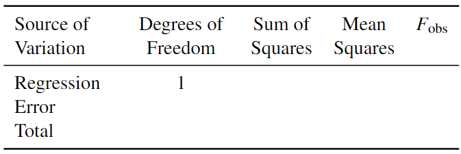
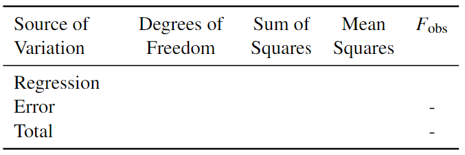

# Written questions


## Question 1

Given the following summary statistics

$$\sum_{i=1}^{20} \left(Y_i - \hat{Y}_i\right)^2 = 6.94983 \quad\quad \sum_{i=1}^{20} \left(Y_i - \bar{Y}\right)^2 = 13.09869,$$

complete the analysis of variance table below.

<center>

{width=450px}

</center>


## Question 2

The following linear model was fitted to some data:

\[\mathbb{E}(Y_i) = \beta_0 + \beta_1 x_i, \quad i = 1,\ldots, 50.\]

The \texttt{R} output and some summary statistics from the data are given below:

```{r echo=FALSE}
iris2 <- iris[iris$Species=="setosa",]
x <- iris2$Sepal.Width
y <- iris2$Sepal.Length
summary(lm(y~x))

anova(lm(y~x))
```

```{r eval=FALSE, echo=FALSE}
print(c(mean(x), mean(y)))
print(c(sum((x-mean(x))^2),sum((y-mean(y))^2),sum((x-mean(x))*(y-mean(y)))))
```

\[ \bar{x} = 3.4280  \quad\quad \bar{y} = 5.0060\]
\[\sum_{i=1}^{50} (x_i - \bar{x})^2 = 7.0408 \quad\quad \sum_{i=1}^{50} (y_i - \bar{y})^2 = 6.0882 \quad\quad \sum_{i=1}^{50} (x_i - \bar{x})(y_i - \bar{y}) = 4.8616\]

|      a. Use the summary statistics to obtain the estimated parameters of $\hat{\beta}_0$ and $\hat{\beta}_1$. 
|          Check your answers with the column of `Estimate` in `R`.
\vsp

|      b. Use the summary statistics to complete the analysis of variance table below, 
|          i.e. finding the degrees of freedom, the regression sum of squares, the error sum of squares, 
|          the mean squared error, and the $F$-statistic. Check your answer with the `R` output. 

<center>
{width=450px}
</center>

|      c. What hypotheses are being examined by the $F$-statistic in the ANOVA table? 
|          Given that its $p$-value $< 0.05$, what does this tell us about the fitted model?
|      d. Compute and interpret the coefficient of determination, $R^2$.
|      e. Comment on the strength of linear relationship between $x$ and $Y$. 